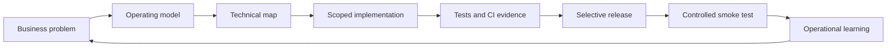

# Gonzalo Burgos — Business, Product & Engineering

I build operating systems for real businesses: translating commercial, legal and operational requirements into software, workflows, controls and repeatable delivery.

My work sits at the intersection of **business design, product ownership and engineering execution**. I use AI-assisted development intensively, but the operating model is human-led: requirements, architecture, risk boundaries, acceptance criteria and release decisions stay explicit and traceable.

## Selected work

| Project | What it demonstrates | Source model |
| --- | --- | --- |
| [Engineering Governance](../) | Engineering operating standards, issue-driven execution, branch/PR discipline, selective deploy and fail-closed safeguards | Public |
| [TMJ Securitizadora](./tmj-securitizadora/) | Financial operations platform, role-specific applications, document workflows, operational queues, idempotency and guarded Firebase delivery | Private source / public case study |
| [Tallerito](./tallerito/) | Automotive-workshop SaaS, PHP/MySQL modernization, DEV/Production isolation, vehicle-data enrichment and a secure AI-action foundation | Private source / public case study |

## What I do

### Product and operating-model design

I start from the actual business process rather than from a screen list. The work includes defining states, ownership, hand-offs, invariants, exception paths, human checkpoints and the data that must remain canonical across the workflow.

### Engineering direction

I convert that operating model into an explicit technical map: existing architecture to reuse, affected surfaces, security boundaries, tests, deployment impact and completion criteria. The objective is to avoid duplicate systems and make changes understandable before implementation begins.

### AI-assisted implementation

I use AI coding systems as execution partners for repository inspection, implementation, regression tests, documentation and release operations. The model is not "prompt and hope": work is constrained by repository rules, package scope, branches, pull requests, CI evidence and post-merge verification.

### Release and operational safety

I favor selective deployment, least privilege and fail-closed behavior. Validation and publication are treated as different concerns. Sensitive systems are tested with fixtures, mocks, emulators, isolated development data or controlled smoke tests rather than by mutating real production records.

## Delivery model

The process is designed to keep speed and control compatible: ship small, preserve existing architecture, document decisions, and make deployment scope explicit.

## Engineering themes across the portfolio

- workflow and state-machine design;
- canonical identities and traceable transitions;
- idempotent operations and retry-safe integrations;
- secure authentication/authorization boundaries;
- reusable application services instead of duplicated page logic;
- CI/CD governance and selective deployment;
- regression testing around business-critical flows;
- mobile operational UX and information-dense back-office interfaces;
- AI interfaces constrained by explicit server-side action boundaries;
- incremental modernization without unnecessary rewrites.

## Why the production repositories are private

The private repositories contain implementation detail that should not be exposed simply to prove that the work exists: production architecture, operational data models, provider integrations, security boundaries and proprietary business logic.

This portfolio therefore uses **curated case studies and synthetic examples**. It shows how the systems are designed and how the engineering work is governed without turning public documentation into an attack map.

## CV-ready summary

A concise professional summary suitable for a CV, proposal or profile is available in [`CV-SUMMARY.md`](./CV-SUMMARY.md).

---

**Public evidence:** the governance model in this repository is itself versioned, inspectable and used as the operating baseline for the private projects represented here.
