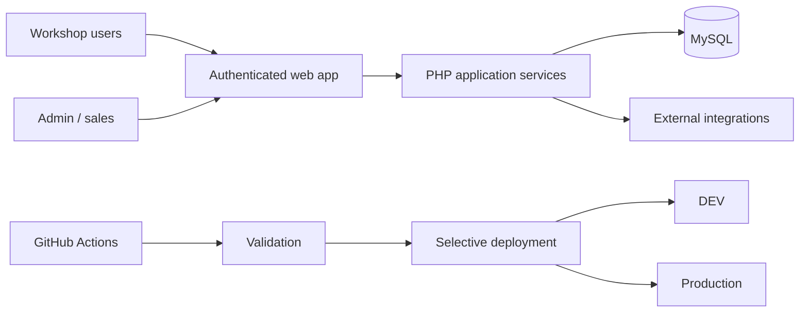

# Tallerito — Public Technical Case Study

> Production source is private by design. This page is a curated engineering overview, not a source-code mirror.

## Product scope

Tallerito is a web SaaS for automotive workshops, designed to centralize day-to-day operations such as work orders, vehicle history, customers, stock and administration in a browser-based product.

The engineering challenge is to evolve a live PHP/MySQL product quickly while preserving operational continuity, DEV/Production separation, secure integrations and a coherent user experience across old and new modules.

## Architecture at a glance

### Core technology

- PHP
- MySQL
- HTML / CSS / JavaScript
- Hostinger runtime
- GitHub Actions
- isolated DEV and Production environments

## Selected engineering themes

### 1. Canonical business services behind multiple interfaces

Core actions are progressively extracted from page-specific handlers into reusable application services. This reduces the risk that a new interface — for example an AI-assisted flow — bypasses the same validation and business rules used by the traditional UI.

### 2. Operational continuity during modernization

The product evolves without a wholesale rewrite. Existing architecture is reused and hardened incrementally, including a canonical page shell, selective deployments and compatibility with the current PHP/CSS runtime.

### 3. Secure AI action boundary

The AI layer is designed around an explicit allowlist of supported actions rather than free SQL or unrestricted backend access. Server-side authorization, auditability and idempotency remain authoritative regardless of whether the request originates from a traditional screen or a natural-language interface.

### 4. Mobile-first interaction patterns

The application is being expanded with mobile-oriented interactions that reduce friction for workshop users, including voice-driven workflows. These capabilities are introduced behind the same server-side business boundary rather than creating parallel logic.

### 5. Data and integration isolation

Runtime credentials, payment configuration, e-mail configuration and other sensitive provider details are kept out of version control. DEV and Production are treated as separate environments, and validation is intentionally separated from publication.

## Selected product/engineering outcomes

- web-based workshop workflow with centralized work-order history;
- reusable page-shell conventions across authenticated screens;
- selective DEV/Production CI/CD instead of indiscriminate uploads;
- automated vehicle-data enrichment with graceful fallback when external data is unavailable;
- sales/admin tooling integrated into the same product governance;
- reusable AI action foundation with explicit security boundaries;
- regression checks around critical operational flows.

## Active development

Voice interaction and external AI-channel capabilities are evolving incrementally. The public case study describes the engineering direction and security model without publishing provider credentials, private API contracts or production implementation details.

## Sanitized example

[`examples/ai-action-boundary.php`](./examples/ai-action-boundary.php) is **synthetic** and illustrates the allowlisted-action pattern. It is not copied from the production repository.

## What is deliberately not public

This case study does **not** publish workshop/customer records, database schemas, payment credentials, private provider endpoints, runtime configuration, authentication internals, deployment credentials or production source files.

The private repository remains the canonical source of truth.
