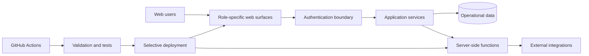

# TMJ Securitizadora — Public Technical Case Study

> Production source is private by design. This page is a curated engineering overview, not a source-code mirror.

## Product scope

TMJ Securitizadora is being developed as an integrated digital operating platform for a financial business, with distinct experiences for institutional visitors, internal operations, investors and business clients.

The engineering objective is broader than creating screens: the platform has to preserve traceability across operational workflows, keep financially sensitive logic consistent, support document/signature flows, and evolve without turning deployment into an operational risk.

## Architecture at a glance

### Core technology

- Firebase Hosting
- Firebase Authentication
- Cloud Firestore
- Cloud Storage
- Cloud Functions v2
- GitHub Actions
- JavaScript web applications

## Selected engineering themes

### 1. Workflow integrity over isolated screens

Operational domains are treated as connected workflows rather than unrelated CRUD pages. The system preserves a canonical business identity as cases move through operational stages, so different teams do not create competing records for the same underlying customer or obligation.

### 2. Idempotent document and communication flows

Actions that can be retried — document generation, delivery requests, user-triggered submissions and integration calls — are designed around deterministic identities, explicit states and safe retry behavior. The public portfolio intentionally omits production identifiers, provider contracts and implementation details.

### 3. Financially sensitive change control

Tests are designed to avoid mutating real production financial records. Pure modules, fixtures, mocks and Firebase emulators are used where applicable. Critical workflows receive controlled smoke testing after publication.

### 4. Selective, fail-closed deployment

A small code change should not implicitly publish the whole platform. Deployment scope is mapped to the components that actually changed. Serverless deployment is designed to fail closed when the impact cannot be mapped safely rather than using a full deploy as a convenience fallback.

### 5. Operational UX for dense back-office work

Internal interfaces prioritize compact information density, persistent filters, non-blocking background loading and explicit operational status. This matters in high-frequency queues where latency and visual ambiguity become operational costs.

## Engineering outcomes demonstrated by the private implementation

- multiple role-specific web applications under one governed architecture;
- reusable domain services instead of duplicated business logic;
- stateful operational queues with traceable transitions;
- document/signature delivery patterns built for retries and recovery;
- regression coverage around critical workflows;
- CI/CD safeguards separating validation from deployment;
- selective publication by affected component.

## Sanitized example

The example in [`examples/selective-deploy-policy.js`](./examples/selective-deploy-policy.js) is **synthetic**. It demonstrates the fail-closed deployment idea without reproducing production paths, services or configuration.

## What is deliberately not public

This case study does **not** publish customer/investor data, financial formulas, credit criteria, contract content, security rules, private endpoints, database structure, service-account details, secrets or production source files.

That boundary is part of the engineering design, not an omission.
