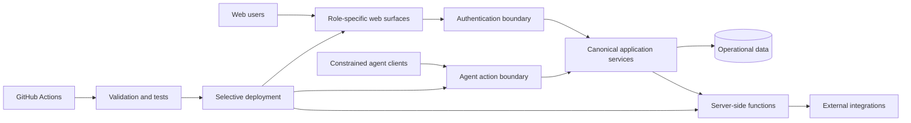

# TMJ Securitizadora — Public Technical Case Study

> Production source is private by design. This page is a curated engineering overview, not a source-code mirror.

## Product scope

TMJ Securitizadora is being developed as an integrated digital operating platform for a financial business, with distinct experiences for institutional visitors, internal operations, investors and business clients.

The engineering objective is broader than creating screens: the platform has to preserve traceability across operational workflows, keep financially sensitive logic consistent, support document/signature flows, and evolve without turning deployment into an operational risk.

## Architecture at a glance

### Core technology

- Firebase Hosting
- Firebase Authentication
- Cloud Firestore
- Cloud Storage
- Cloud Functions v2
- containerized Node.js services
- GitHub Actions
- JavaScript web applications

## Selected engineering themes

### 1. Workflow integrity over isolated screens

Operational domains are treated as connected workflows rather than unrelated CRUD pages. The system preserves a canonical business identity as cases move through operational stages, so different teams do not create competing records for the same underlying customer or obligation.

### 2. Idempotent document and communication flows

Actions that can be retried — document generation, delivery requests, user-triggered submissions and integration calls — are designed around deterministic identities, explicit states and safe retry behavior. The public portfolio intentionally omits production identifiers, provider contracts and implementation details.

### 3. Financially sensitive change control

Tests are designed to avoid mutating real production financial records. Pure modules, fixtures, mocks and Firebase emulators are used where applicable. Critical workflows receive controlled smoke testing after publication.

### 4. Selective, fail-closed deployment

A small code change should not implicitly publish the whole platform. Deployment scope is mapped to the components that actually changed. Serverless deployment is designed to fail closed when the impact cannot be mapped safely rather than using a full deploy as a convenience fallback.

### 5. Operational UX for dense back-office work

Internal interfaces prioritize compact information density, persistent filters, non-blocking background loading and explicit operational status. This matters in high-frequency queues where latency and visual ambiguity become operational costs.

### 6. Secure agentic operations

Current engineering work adds a constrained remote-agent boundary over existing application services. Authentication and delegated access remain scope-limited; actions are explicitly allowlisted and evaluated server-side. Material operations use deterministic idempotency, claims/leases and correlation IDs. Unsafe operations can hard-stop, while objective exceptions can be routed to typed human queues.

The agent layer does not receive arbitrary datastore access and does not duplicate the authoritative financial/document workflow. It calls canonical server-side business boundaries so the traditional UI and agent-driven flows remain governed by the same invariants.

A fully independent public implementation of these patterns is available in [Agentic Operations Gateway](../../reference/agentic-operations-gateway/).

### 7. Deterministic high-volume migrations

Migration tooling separates **plan, review, authorization and apply** instead of treating an import file as permission to overwrite live state. Records can be classified as create/no-op/conflict/preserve; conflicts require explicit decisions; authorization is bound to deterministic state; workers can resume in chunks and fail closed when the live base changed unexpectedly.

This design supports large migrations and repeated dry runs while preserving live-only data unless deletion is separately and deliberately modeled.

A synthetic executable version of the pattern is available in [Deterministic Data Migrations](../../reference/deterministic-data-migrations/).

### 8. Scale-safe reporting

Reporting paths are designed to paginate complete datasets rather than rely on arbitrary record ceilings. Bounded concurrency and shared aggregation avoid repeated full scans of the same business data, and completeness metadata makes truncation observable instead of silent.

## Engineering outcomes demonstrated by the private implementation

- multiple role-specific web applications under one governed architecture;
- reusable domain services instead of duplicated business logic;
- stateful operational queues with traceable transitions;
- document/signature delivery patterns built for retries and recovery;
- constrained agent actions with explicit server-side authority boundaries;
- resumable migration/reconciliation tooling with deterministic conflicts;
- scale-safe reporting without silent business-record caps;
- regression coverage around critical workflows;
- CI/CD safeguards separating validation from deployment;
- selective publication by affected component.

## Sanitized example

The example in [`examples/selective-deploy-policy.js`](./examples/selective-deploy-policy.js) is **synthetic**. It demonstrates the fail-closed deployment idea without reproducing production paths, services or configuration.

## What is deliberately not public

This case study does **not** publish customer/investor data, financial formulas, credit criteria, contract content, security rules, private endpoints, database structure, service-account details, secrets or production source files.

That boundary is part of the engineering design, not an omission.
