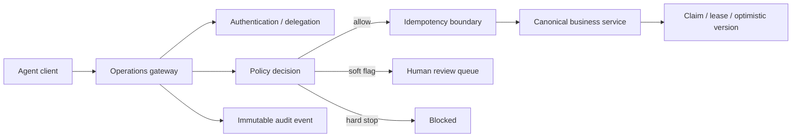

# Architecture

This reference implementation demonstrates a narrow **agent-to-business boundary** rather than an autonomous agent with direct datastore access.

## Core invariants

1. The agent never receives arbitrary datastore access.
2. Authentication establishes a constrained principal; delegation can only reduce scopes.
3. Policy is evaluated server-side for every action.
4. Hard stops cannot be bypassed by having a broader scope.
5. Material exceptions can become typed human-review work instead of silent failure or unsafe continuation.
6. Material mutations are idempotent by caller-supplied mutation ID plus deterministic payload fingerprint.
7. Work ownership is lease-based and recoverable after expiration.
8. Retries are finite.
9. Versioned writes reject stale state.
10. Audit records contain identities and outcomes, not raw credentials.

The production systems that inspired these patterns remain private; this module is an independent implementation for public technical demonstration.
