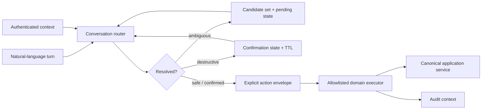

# Architecture

## Invariants

1. The conversation layer does not receive arbitrary backend authority.
2. Actor and workspace context are required before routing.
3. Ambiguity is surfaced, not guessed through.
4. Candidate selection inherits only a live pending intent.
5. Destructive actions require an explicit confirmation state.
6. Generic affirmation without a pending action performs nothing.
7. Pending state expires.
8. The executor accepts only configured domain actions.
9. Audit context follows the action envelope into execution.
