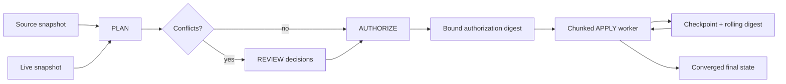

# Architecture

The reference separates migration into explicit phases rather than treating an import file as an instruction to overwrite a live database.

## Classification

For every stable record ID:

- **CREATE** — present in source, absent live;
- **NOOP** — source and live canonical hashes match;
- **CONFLICT** — both exist but differ;
- **PRESERVE** — present only in live.

There is intentionally no implicit DELETE classification.

## Authorization model

Every conflict must receive an explicit `APPLY_SOURCE` or `KEEP_LIVE` decision. The authorization digest binds:

- the deterministic plan ID;
- the original live-base digest;
- all conflict decisions;
- the exact mutation actions.

A worker cannot silently apply a different plan under an old authorization.

## Resume model

Each chunk verifies the current live digest against the checkpoint's rolling digest before applying the next authorized actions. A stale or replayed checkpoint fails closed instead of double-applying work.
